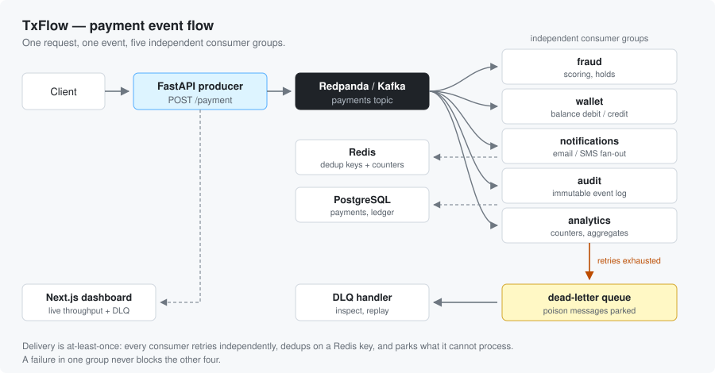

# TxFlow — Payment Event Orchestrator

TxFlow is an event-driven payments workflow: a `POST /payment` request produces one Kafka event, and multiple independent consumer groups process it (fraud, wallet, notifications, audit, analytics) with retries, deduplication, and a DLQ.

## Architecture



Each consumer group owns its own offset, so a failure in one never blocks the other four. Retries are per-consumer, deduplication is a Redis key, and anything still failing is parked in the DLQ for the handler service to inspect or replay.

## Backend (what’s used)
- **Kafka**: Redpanda + Redpanda Console UI
- **API**: FastAPI (Python)
- **DB**: PostgreSQL
- **Cache**: Redis (dedup + analytics counters)
- **Consumers**: Python (`confluent-kafka`)
- **Orchestration**: Docker Compose

## Frontend (what’s used)
- **Next.js + TypeScript**
- **shadcn/ui + Tailwind**
- Uses Next API routes as a proxy to backend services

## Run (backend + frontend)
From repo root:

```bash
cd txflow
cp .env.example .env
docker compose up -d --build
```

## URLs
- **Dashboard**: `http://localhost:3000`
- **Producer**: `http://localhost:8000/health` and `http://localhost:8000/analytics`
- **DLQ handler**: `http://localhost:8001/dlq`
- **Redpanda Console**: `http://localhost:8080`

## Repo structure (high level)
```
txflow/      # docker-compose + backend services
frontend/    # Next.js dashboard
```

